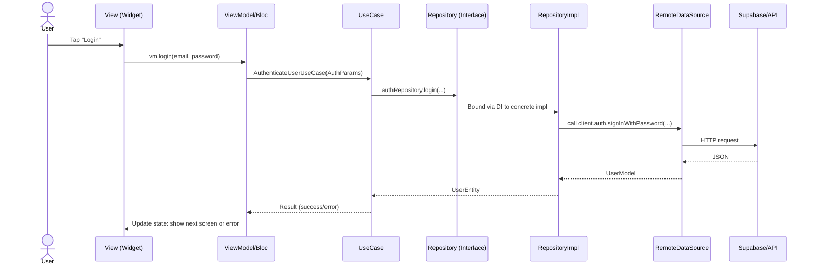

## Clean Architecture Flow (Stupid Simple)

This explains, in plain words, what happens from a button tap in the UI all the way down to your data source (Supabase/API/DB), and back. Lots of pictures, few buzzwords.

## TL;DR: One Tap Journey



## The Cast (Who does what?)

- **View (Widget/Page)**: Renders pixels. Listens to state. Sends user intents to the ViewModel. No business rules.
- **ViewModel / Bloc / Controller**: Orchestrates the UI state. Calls UseCases. Transforms results into UI-friendly state.
- **UseCase**: A single app action (verb), e.g., AuthenticateUser, GetProducts. It knows which repository method to call. No UI, no network code.
- **Repository (Interface)**: The contract the domain trusts. Describes what data actions exist (login, getProducts). No implementation details.
- **RepositoryImpl (Concrete)**: Knows how to fulfill the contract using Data Sources. Converts Models ↔ Entities.
- **Data Source (Remote/Local)**: Talks to the outside world (Supabase/API/DB/cache). Returns raw data Models.
- **Entity (Domain Model)**: Pure, stable business object used by UseCases and UI layer. No JSON mapping inside.
- **Model/DTO (Data Model)**: Mirrors raw data shapes (e.g., JSON). Has fromJson/toJson and toEntity.
- **Dependency Injection (DI)**: Wiring that tells the app which concrete class to use for each interface.

## Big Picture Map

```mermaid
graph TD
  V[View<br/>(Widgets/Pages)] --> VM[ViewModel / Bloc]
  VM --> UC[UseCase]
  UC --> R[[Repository (Interface)]]
  R -.via DI.-> RI[RepositoryImpl]
  RI --> DS[RemoteDataSource]
  DS --> API[(Supabase / API / DB)]

  %% Cross-layer relationships
  UC --- E[Entities]
  RI --- M[Models/DTOs]

  style V fill:#e8f5ff,stroke:#7bb7ff
  style VM fill:#e8f5ff,stroke:#7bb7ff
  style UC fill:#e8ffe8,stroke:#7bff7b
  style R fill:#fff3e0,stroke:#ffb74d
  style RI fill:#fff3e0,stroke:#ffb74d
  style DS fill:#ffe8f0,stroke:#ff7bb7
  style API fill:#f5f5f5,stroke:#bbb
  style E fill:#e8ffe8,stroke:#7bff7b
  style M fill:#ffe8f0,stroke:#ff7bb7
```

## Why split it like this?

- **Change UI without touching business rules.**
- **Swap Supabase for another backend** by changing only Data layer.
- **Easy to test** UseCases and Repositories in isolation.

## Step-by-step: From View to Data Source

1) View
- Shows a button. On tap, calls a method on the ViewModel.

2) ViewModel / Bloc
- Receives intent (e.g., login).
- Calls the matching UseCase with needed parameters.
- Shows loading; then listens for success/error to update UI state.

3) UseCase
- Encapsulates one action (AuthenticateUser, GetProducts, etc.).
- Calls the Repository interface. No idea how data is fetched.

4) Repository (Interface)
- Defines the methods the UseCase needs (login, logout, isAuthenticated, getProducts...).
- Keeps the domain independent of frameworks.

5) RepositoryImpl (Concrete)
- Implements the interface.
- Calls Data Sources to actually fetch/persist data.
- Maps Models (from Data) into Entities (for Domain/UI).

6) Data Source (Remote/Local)
- Talks directly to Supabase/API/DB.
- Returns raw data Models or throws errors.

7) Back up the chain
- RepositoryImpl converts raw Models → Entities.
- UseCase returns Entities/Results to ViewModel.
- ViewModel updates UI state; View re-renders.

## Where things live (in this repo)

- View/UI: `lib/features/*/view/` (pages/widgets)
- ViewModel/Bloc: `lib/features/*/view_model/`
- UseCases: `lib/features/*/domain/usecases/`
- Entities: `lib/features/*/domain/entities/`
- Repository interfaces: `lib/features/*/domain/repositories/`
- Repository implementations: `lib/features/*/data/repositories/`
- Data sources: `lib/features/*/data/datasources/`
- Models/DTOs: `lib/features/*/data/models/`
- DI wiring: `lib/di.dart`
- Core base types: `lib/core/usecase/usecase.dart`

## Tiny Code Glimpses (to connect the dots)

UseCase base you already have:

```dart
abstract class UseCase<Type, Params> {
  Future<Type> call(Params params);
}

class NoParams {
  const NoParams();
}
```

Auth remote data source shape (talks to Supabase):

```dart
abstract class AuthRemoteDataSource {
  Future<UserEntity> login(String email, String password);
  Future<UserEntity> signup(String email, String password);
  Future<void> logout();
  Future<bool> isAuthenticated();
}
```

Repository interface vibe (domain owns the contract):

```dart
abstract class AuthRepository {
  Future<UserEntity> login(String email, String password);
  Future<void> logout();
  Future<bool> isAuthenticated();
}
```

RepositoryImpl idea (bridges domain ↔ data):

```dart
class AuthRepositoryImpl implements AuthRepository {
  final AuthRemoteDataSource remote;
  AuthRepositoryImpl(this.remote);

  @override
  Future<UserEntity> login(String email, String password) {
    return remote.login(email, password); // map Models <-> Entities as needed
  }
}
```

## Entities vs Models (why two types?)

- **Entity**: What your app cares about conceptually. Stable, framework-free. Example: `UserEntity { id, email }`.
- **Model/DTO**: Mirrors the raw data shape from outside. Has `fromJson`/`toJson`. If the API changes, you fix Models and mapping, not Entities.

```mermaid
graph LR
  J[JSON from API] --> M[UserModel]
  M -->|toEntity()| E[UserEntity]
  E -->|used by| UC[UseCase]
```

## Dependency Injection (DI) in one breath

- DI is the wiring that binds interfaces to implementations.
- The UI asks for `AuthRepository`, DI gives `AuthRepositoryImpl` with its `AuthRemoteDataSource` inside.
- Result: inner layers know nothing about outer implementations.

```mermaid
graph LR
  R[[AuthRepository (interface)]] -.bound by DI.-> RI[AuthRepositoryImpl]
  RI --> DS[AuthRemoteDataSourceImpl]
```

## Error handling (keep it simple)

- Data Source throws/returns failures from API.
- RepositoryImpl may translate them (e.g., network → friendly error).
- UseCase returns success/error to ViewModel.
- ViewModel decides what to show (snackbar, dialog, error text).

## Testing quick wins

- Test UseCases with mocked Repositories.
- Test RepositoryImpl with mocked Data Sources.
- Test ViewModels with mocked UseCases.

## Cheat Sheet

- **View**: shows stuff, sends intents.
- **ViewModel**: holds state, calls UseCases.
- **UseCase**: one action, calls Repository interface.
- **Repository (interface)**: what actions exist.
- **RepositoryImpl**: how to do them using Data Sources.
- **Data Source**: talks to API/DB.
- **Entities**: clean core types.
- **Models/DTOs**: API-facing shapes.
- **DI**: wires interface → implementation.

That’s it. One tap goes down the stack to fetch/save data, then bubbles back up as clean, UI-friendly state.


